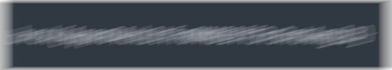
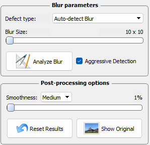
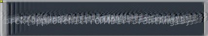

# BraekerCTF

## Eye doctor

> A creaky old bot is zooming in and out of an eye chart. "Can you read the bottom line?" the doctor asks. "No way, " the bot replies. "At a certain distance my view becomes convoluted. Here, I'll make a screenshot."
>
> You and the doctor look at the screenshot. Can you tell what's wrong with the bot's visual processor?
>
>  Author: n/a
>
> 

## Solution

We get this image that just has very blurry out text

I found this tool [smartdeblur](http://smartdeblur.net/download.html)

Using these settings:
 

I got this output:
 

It is not the most clear image but the flag is readable: `brck{4ppr04ch1tfr0M4D1ff3r3ntAngl3}`