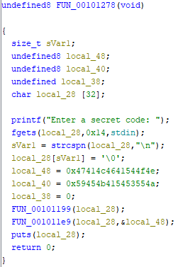
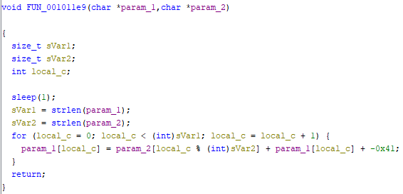

# Keyalgo

In this one you need to get the given binary to print `tHisi5aflA9takei7`

```
$ ./keyalgo
Enter a secret code: Hello world
uslt+wu{�v
```

After running it we see that it takes a string as an input and modifies it

When you run it with ltrace you find that it strlens the given input and another string `NOTAFLAGJUSTAKEY`

Opening it on ghidra we can see it takes 0x14 characters from stdin and swaps '\n' to '\0'
Then there is 2 variables that hold some hex values and if we check the values behind them we find the previously found `NOTAFLAGJUSTAKEY`




It then calls a function on our provided string but it doesn't modify the string so we can skip it

Then it takes our string and the key string and here is what that one looks like



With very small modifications we can bruteforce the flag from this function

```
#include <stdio.h>
#include <string.h>

void FUN_001011e9(char *param_1,char *param_2)
{
  size_t sVar1;
  size_t sVar2;
  int local_c;
  
  sVar1 = strlen(param_1);
  sVar2 = strlen(param_2);
  for (local_c = 0; local_c < (int)sVar1; local_c = local_c + 1) {
    for (char c = 0; c < 127; c++)
    {
        char tmp = c;
        tmp = param_2[local_c % (int)sVar2] + tmp + -0x41;
        if (param_1[local_c] == tmp)
        {
            printf("%c", c);
            break;
        }
    }
  }
  printf("\n");
  return;
}

int main()
{
    char *output = "tHisi5aflA9takei7";
    char *key = "NOTAFLAGJUSTAKEY";

    FUN_001011e9(output, key);
    return 0;
}
```

Testing the flag on the original bin confirms that we got it: ```xctf{g:Vsd*a`c-'aaaaQ*}```

```
$ ./a.out 
g:Vsd*a`c-'aaaaQ*
$ ./keyalgo
Enter a secret code: g:Vsd*a`c-'aaaaQ*
tHisi5aflA9takei7
```