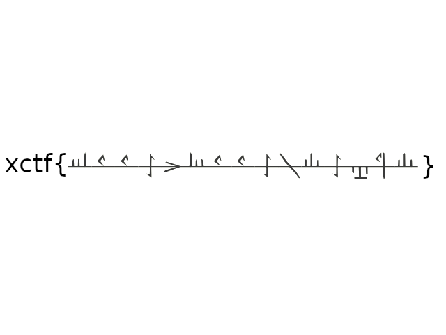
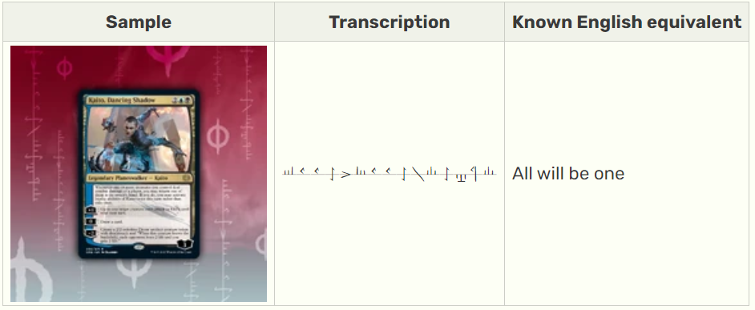

# Card games

You get this image with the flag in some weird symbols

using google lens on the symbols the first hit is this reddit post with very similar looking symbols https://www.reddit.com/r/magicTCG/comments/nqwqhn/first_release_of_progress_engine_font/

The symbols are very similar but not quite the same. The first comment on the post gives us a google drive link that has a conversion table pdf for the symbols and the title of the pdf is `Proposed Phyrexian phonemes and orthography`

Googling the words `Phyrexian phonemes` will give us this wiki page https://mtg.fandom.com/wiki/Phyrexian_(language)

There is the symbol table and we got exact match for our symbols. Now we could convert them symbol by symbol. But if we scroll a little bit down on the page we find this

So we found the flag `xctf{All will be one}`